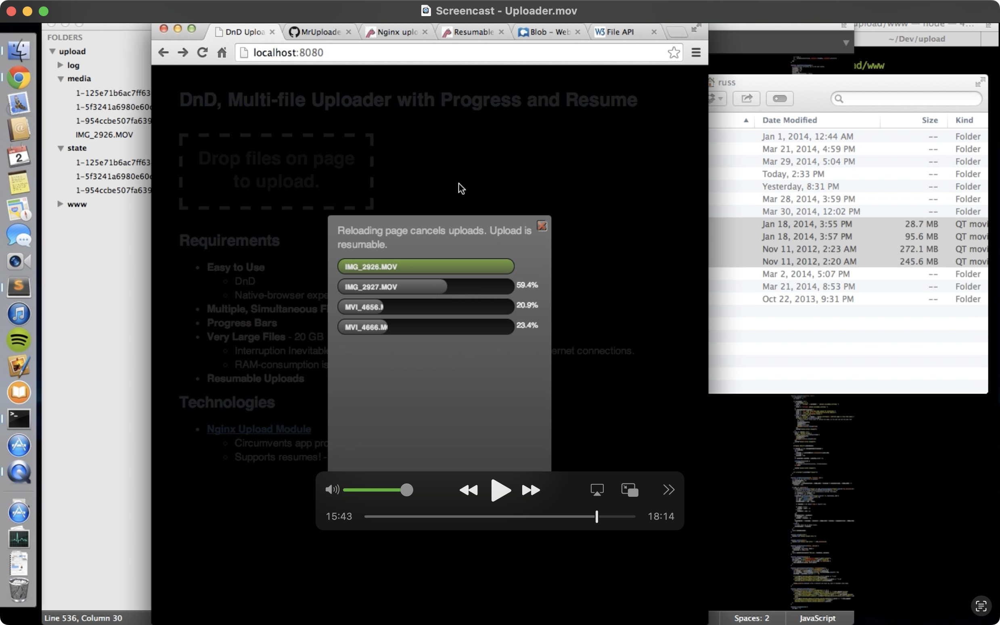

# Dnd Uploader

## Vanilla JS DnD Multi-File Uploader with Resumes

* **Uses the venerable [Nginx Upload Module](https://github.com/vkholodkov/nginx-upload-module/)**
* **Simultanous multiple files**
* **Resumable** - Just drag the files back in later.
* **Massively Large Files** - 200 GB Movie? No problem.
* **Fast** - Streams directly thru Nginx unbeknownst to your slow App processes. Zero RAM inflation to your Ruby processes.

This hadn't been done before on the entire Internet, in a browser-native way. I had to reverse-engineer this [Silverlight plugin's C# Code](https://github.com/dmitry-dedukhin/MrUploader/blob/master/MrUploader/Code/Uploader.cs)

## Demo

